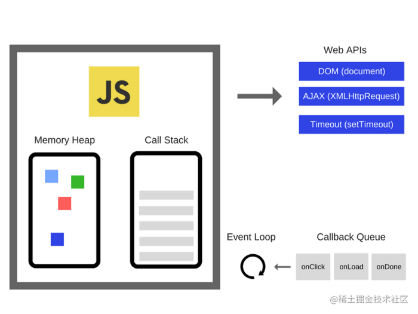

### JS 的设计模式

-   单例模式：保证一个类仅有一个实例，并提供一个访问它的全局访问点。实现的方法为先判断实例存在与否，如果存在则直接返回，如果不存在就创建了再返回，这就确保了一个类只有一个实例对象。
-   策略模式：定义一系列的算法，把他们一个个封装起来，并且使他们可以相互替换。
-   代理模式（命令模式）：为一个对象提供一个代用品或占位符，以便控制对它的访问。
-   中介者模式：通过一个中介者对象，其他所有的相关对象都通过该中介者对象来通信，而不是相互引用，当其中的一个对象发生改变时，只需要通知中介者对象即可。通过中介者模式可以解除对象与对象之间的紧耦合关系。
-   装饰者模式：在不改变对象自身的基础上，在程序运行期间给对象动态地添加方法。

### JS的原型链

### 垃圾回收机制
根据存活时间，内存分为新生代和老生代
- 新生代：由from和to两部分组成，from 为正在使用的内存，to为闲置内存；默认情况下,内存大小为
64位：from和to各占16M，32位：from和to各占8M

- 老生代
64位：占1400M 32位：占700M
#### 新生代的内存回收
先将from里的对象检查一遍，如果对象存活，则复制到to中（按顺序排放），将非存活对象进行回收,当所有存活对象进入to中，然后交换from和to，from变为闲置内存，to变为正在使用内存
如果一个对象经过多次交换依然存在或者新的数据太大，则将其放置在老生代中

#### 老生代的内存回收
- 标记清除
在这个阶段分为标记阶段和清除阶段，首先会遍历堆中的所有对象，并做上标记，对于那些在代码环境中使用的变量和强引用的变量 进行取消标记
剩下被标记的变量就是需要被回收的变量，在随后的清除阶段进行回收

- 标记整理
在清除阶段完成后，由于是在堆里清除，所以清除完后会产生内存碎片问题，存活对象的空间不连续导致对后续分配空间造成障碍，所以需要整理碎片：将存活的对象全部往一边靠拢，由于是移动对象，它的执行速度不可能很快，事实上也是整个过程中最耗时间的部分。

- 优化— 增量标记
由于JS的单线程机制，V8 在进行垃圾回收的时候，不可避免地会阻塞业务逻辑的执行，倘若老生代的垃圾回收任务很重，那么耗时会非常可怕，严重影响应用的性能。那这个时候为了避免这样问题，V8 采取了增量标记的方案。
将标记任务分为许多小任务，在执行完一个小任务后，让js的逻辑代码执行一会儿，然后再执行下一个小任务。

经过增量标记之后，垃圾回收机制对js的阻塞时间降低至原来的1/6

### 事件循环机制

1. 函数入栈，当Stack中执行到异步任务的时候，就将他丢给WebAPIs,接着执行同步任务,直到Stack为空;
2. 在此期间WebAPIs完成这个事件，把回调函数放入CallbackQueue中等待;
3. 当执行栈为空时，Event Loop把Callback Queue中的一个任务放入Stack中,回到第1步。
4. Event Loop是由javascript宿主环境（像浏览器）来实现的;
5. WebAPIs是由C++实现的浏览器创建的线程，处理诸如DOM事件、http请求、定时器等异步事件;
6. JavaScript 的并发模型基于"事件循环";
7. Callback Queue(Event Queue 或者 Message Queue) 任务队列,存放异步任务的回调函数
