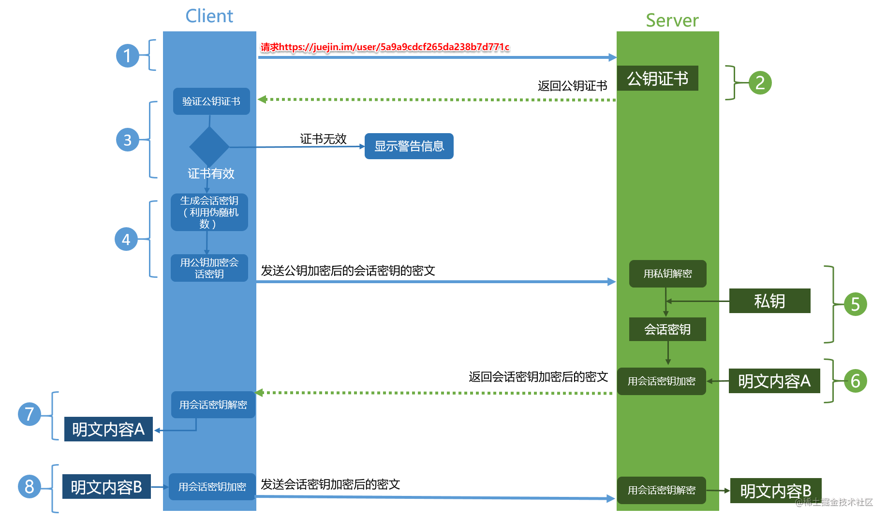

### XSS的类型
1. 反射型（非持久）：通过URL参数直接注入
2. 存储型（持久）：存储到数据库后读取时注入
3. 基于DOM：被执行的恶意脚本会修改页面脚本结构
4. 
### XSS的注入点
1. HTML的节点内容或属性
2. javascript代码
3. 富文本

- HttpOnly 防止劫取 Cookie: HttpOnly 最早由微软提出，至今已经成为一个标准。浏览器将禁止页面的Javascript 访问带有 HttpOnly 属性的Cookie。
- 输入检查: 对所有输入都要进行过滤，在一些前端框架中，都会有一份 decodingMap， 用于对用户输入所包含的特殊字符或标签进行编码或过滤，如 <，>，script，防止 XSS 攻击

### CSRF常见的三种攻击方式
1. 自动发起GET请求
黑客提前在第三方网站存好这样一张img图片：
```html

```
当用户点击链接进入此页面之后，会在不知觉的情况下向源站点发送一条转账的HTTP请求，银行站点就会收到包含用户登录信息的一条转账请求。

2. 自动发起POST请求
黑客提前在第三方网站设置好一个隐藏的自动提交表单如下：
``` html
<!DOCTYPE html>
<html>
<body>
  <form id='hacker-form' action="https://bank.com/sendmoney" method=POST>
    <input type="hidden" name="user" value="hacker" />
    <input type="hidden" name="number" value="1000" />
  </form>
  <script> document.getElementById('hacker-form').submit(); </script>
</body>
</html>
```
用户在进入黑客网站之后，就会向源站点发送一条包含个人登录信息的转账POST请求，银行站点校验身份信息通过之后就会发起转账。
虽然说POST比GET请求方式要复杂一些，但是完成攻击还是非常容易，所以后端不能将安全寄托在POST接口上面。

3. 诱导用户点击链接的CSRF攻击
这类攻击往往发生在UGC类型的网站或者论坛上，这类型网站可以允许用户自己发布信息，然后服务器会将用户发布的信息展示在页面上，如果没有做好CSRF防护的话，黑客就可以在发布图片或者链接的时候嵌入恶意链接，当其他用户看到黑客发布的图片或者点击了黑客发布的链接的那一刻，CSRF攻击就发生了，比如：
```html
<a href="https://bank.com/sendmoney?amount=1000&user=hacker" target="_blank">特大新闻！！！点我查看！！！<a/>
```

### CSRF攻击过程
一个典型的CSRF攻击过程如下：

1. 用户A(被攻击者)登录了某银行网站(B.com)，登录成功之后服务端返回了A一个cookie，里面保存的是用户的session_id等身份信息;
2. 用户A受黑客引诱无意间点击了黑客早已准备好的第三方网站(C.com)
3. 黑客在C.com中提前准备写好了自动提交请求的脚本，只要用户进入此黑客网站，请求就会发送(不是通过Ajax请求发送)
4. C.com向银行网站B.com发送了一个转账的请求，由于是向B.com发送的请求所以浏览器会自动在请求头中带上domain=B.com的cookie;
5. 请求到达B网站的服务器之后，进行校验，校验发现携带的cookie中session_id去session库中匹配成功，身份校验通过
6. B网站以为是用户A自己在操作，所以执行本次请求，完成对于黑客账户的转账
7. 攻击完成，黑客在受害者用户A不知情的情况下，冒充受害者让银行网站执行了自己的操作。
8. 
### CSRF攻击的特点
通过上诉对一个完整的CSRF攻击过程的描述，我们发现CSRF攻击要想完成攻击，有一些特点：

1. CSRF攻击多数情况下发起与第三方网站(跨域);
2. CSRF攻击少数情况下发起于当前网站，比如可以提交图片和链接的评论区，这种攻击可以在当前域发起，更加难以追踪;
3. CSRF攻击的攻击对象必须是已经完成登录的用户，并且此用户的登录状态还保持在浏览器端没有过期;
4. CSRF攻击的整个过程中黑客并不能获取受害者的用户凭证，只是冒用。这一点是XSS可以直接获取用户cookie等信息不同。
5. CSRF攻击的手段多样化，可以通过图片URL、超链接、CORS等多种情况发起攻击
### 如何阻止CSRF攻击？
这里特地说明下：

1. 用户个人是否点击某个链接这样的行为我们是无法约束的，我们只能假设用户已经点击链接并进入黑客页面之后，该如何通过技术手段来防止后续对于用户隐私和财产的损失。
2. 任何一种防范手段都不能100%的阻止攻击的发生，只能尽可能的提高网站的安全能力.后续对于如何阻止CSRF攻击的方式也是基于此前提来进行的。

通过上面对于CSRF攻击特点的分析，我们明白了攻击发生的前提条件和特点，主要就是两个大的方向：

1. CSRF攻击大多数发生在第三方站点，由第三方站点发起携带着用户登录状态的跨域请求(当然也有少部分是当前页面的比如UGC评论区发布的恶意链接)
2. CSRF攻击利用了用户保存在浏览器中尚未过期的登录状态如cookie等信息，但只是利用并不能获取。

那么我们的防护策略也应该做针对性的部署：

1. 既然攻击多数发生在第三方站点，那我就要求服务器禁止一切不信任站点的跨域访问;
   - 基于同源策略确定请求发起的站点是否为源站点;
   - 基于cookie的SameSite属性
2. 既然攻击发生时利用的是用户的身份凭证，那我就要求在请求时必须携带只有源站点才有的信息才可以通过身份验证，因为cookie是浏览器自动携带的，但是其他信息浏览器不能自动携带，并且CSRF的特点是无法获取源站点的信息。
3. CSRF Token

### 什么是中间人攻击？
中间⼈ (Man-in-the-middle attack, MITM) 是指攻击者与通讯的两端分别创建独⽴的联系, 并交换其所收到的数据, 使通讯的两端认为他们正在通过⼀个私密的连接与对⽅直接对话, 但事实上整个会话都被攻击者完全控制。在中间⼈攻击中，攻击者可以拦截通讯双⽅的通话并插⼊新的内容。
攻击过程如下:

1. 客户端发送请求到服务端，请求被中间⼈截获
2. 服务器向客户端发送公钥
3. 中间⼈截获公钥，保留在⾃⼰⼿上。然后⾃⼰⽣成⼀个伪造的公钥，发给客户端
4. 客户端收到伪造的公钥后，⽣成加密hash值发给服务器
5. 中间⼈获得加密hash值，⽤⾃⼰的私钥解密获得真秘钥,同时⽣成假的加密hash值，发给服务器
6. 服务器⽤私钥解密获得假密钥,然后加密数据传输给客户端

### https 原理图
