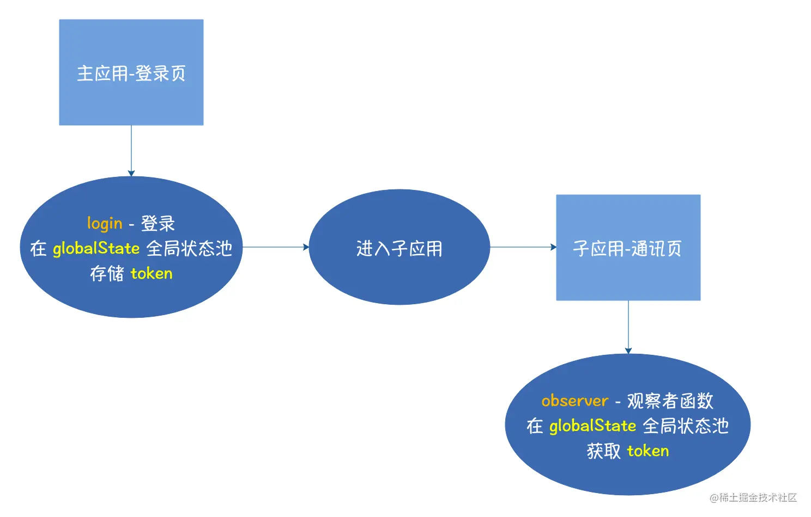
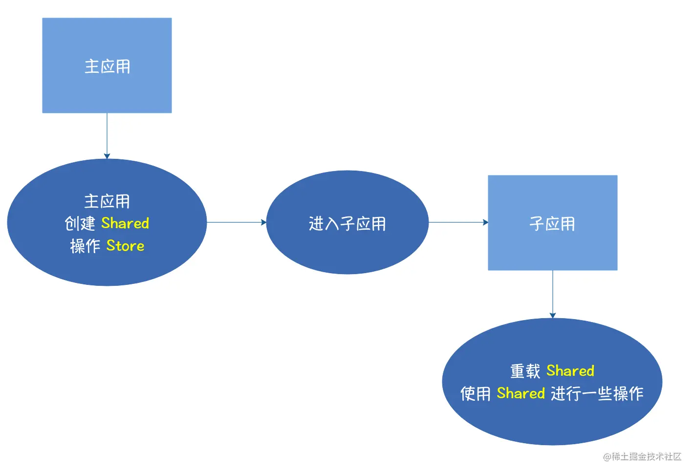

## qiankun
### 微前端应用通信

-   qiankun 官方提供的通信方式 - Actions 通信: 主应用全局状态池和子应用观察者函数进行应用间通信，该通信方式适合大部分的场景。

-   Shared: 父子都设立自己的状态池，通过暴露的方法进行通信


### 实现原理
```js
// 构造一个 with 来包裹需要执行的代码，返回 with 代码块的一个函数实例
function withedYourCode(code) {
  code = 'with(globalObj) {' + code + '}'
  return new Function('globalObj', code)
}

// 沙箱全局代理对象类
class SandboxGlobalProxy {
  constructor(sharedState) {
    // 创建一个 iframe 对象，取出其中的原生浏览器全局对象作为沙箱的全局对象
    const iframe = document.createElement('iframe', { url: 'about:blank' })
    iframe.style.display = 'none' // 不可见
    document.body.appendChild(iframe)
    const sandboxGlobal = iframe.contentWindow // 沙箱运行时的全局对象

    return new Proxy(sandboxGlobal, {
      has: (target, prop) => {
        // has 可以拦截 with 代码块中任意属性的访问
        if (sharedState.includes(prop)) {
          // 如果属性存在于共享的全局状态中，则让其沿着作用域链在外层查找
          return false
        }

        if (!target.hasOwnProperty(prop)) {
          throw new Error(`Invalid expression - ${prop}! You can not do that!`)
        }

        return true
      },
    })
  }
}

function maybeAvailableSandbox(code, ctx) {
  // 将 this 指向手动构造的全局代理对象
  // 将 with 作用域 指向手动构造的全局代理对象
  withedYourCode(code).call(ctx, ctx)
}

const code_1 = `
  console.log(history == window.history) // false

  window.abc = 'sandbox'

  Object.prototype.toString = () => {
    console.log('Traped!')
  }

  console.log(window.abc) // sandbox
`

const sharedGlobal_1 = ['history'] // 希望与外部执行环境共享的全局对象
const globalProxy_1 = new SandboxGlobalProxy(sharedGlobal_1) // 每一个全局上下文对象都是独立的 iframe.contentWindow，以免相互污染
maybeAvailableSandbox(code_1, globalProxy_1)

// 验证外部变量有没被污染
console.log(window.abc) // undefined
Object.prototype.toString() // [object Object] 并没有打印 Traped

```
